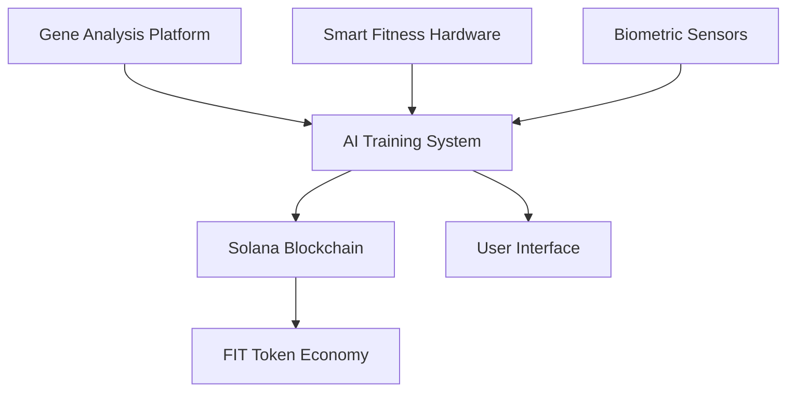

# FitGenesis: Personalized Genetic Fitness Ecosystem

<div align="center">
  
</div>

[](http://fitgenesis.xyz/)
[](https://x.com/FitGenesis)
[](https://github.com/FitGenesis/FitGenesis)

## Overview

FitGenesis is a revolutionary fitness ecosystem that combines personal genetic data, real-time biometric monitoring, and smart home devices, powered by Solana blockchain technology. The platform delivers a truly personalized fitness experience through advanced AI algorithms and blockchain-based incentive mechanisms.

## Key Features

- 🧬 Gene-based Personalized Fitness Plans
- 📊 Real-time Biometric Tracking
- 🤖 AI-powered Training Adjustments
- 💰 Blockchain Incentive System
- 🔒 Data Sovereignty and Privacy Protection

## Technical Architecture

### System Components



### Technology Stack

- **Frontend**: React, TypeScript, TailwindCSS
- **Backend**: Node.js, Express, PostgreSQL
- **Blockchain**: Solana, Rust
- **AI/ML**: TensorFlow, PyTorch
- **DevOps**: Docker, GitHub Actions

## Project Structure

```
FitGenesis/
├── apps/
│   ├── frontend/          # React web application
│   └── backend/           # Node.js REST API
├── contracts/             # Solana smart contracts
├── docs/                  # Documentation
├── scripts/              # Utility scripts
├── assets/               # Project assets
└── shared/               # Shared utilities
```

## Getting Started

### Prerequisites

- Node.js 16+
- Rust 1.65+
- Solana CLI 1.16+
- Docker & Docker Compose

### Installation

1. Clone the repository:
```bash
git clone https://github.com/FitGenesis/FitGenesis.git
cd FitGenesis
```

2. Install dependencies:
```bash
# Install frontend dependencies
cd apps/frontend
npm install

# Install backend dependencies
cd ../backend
npm install

# Install contract dependencies
cd ../../contracts
cargo build
```

3. Set up environment variables:
```bash
cp .env.example .env
```

4. Start the development environment:
```bash
docker-compose up
```

## Documentation

- [Technical Documentation](docs/technical/)
- [API Reference](docs/api/)
- [Smart Contract Documentation](docs/contracts/)
- [Development Guide](docs/development/)

## Contributing

Please read our [Contributing Guidelines](CONTRIBUTING.md) before submitting a Pull Request.

## License

This project is licensed under the MIT License - see the [LICENSE](LICENSE) file for details.

## Contact

- Website: [http://fitgenesis.xyz/](http://fitgenesis.xyz/)
- Twitter: [@FitGenesis](https://x.com/FitGenesis)
- GitHub: [FitGenesis/FitGenesis](https://github.com/FitGenesis/FitGenesis) 