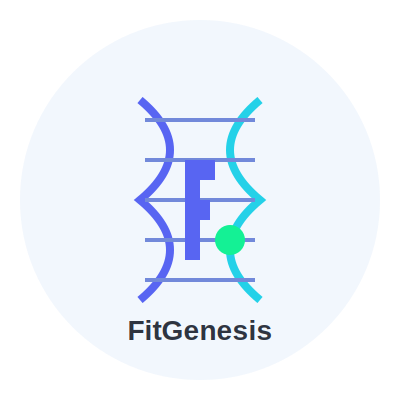

# FitGenesis - AI-Powered Fitness Platform on Solana

<div align="center">
  
</div>

<div align="center">
  🌐 [Official Website](http://fitgenesis.xyz/) | 🐦 [Twitter](https://x.com/FitGenesis)
</div>

FitGenesis is a revolutionary fitness platform that combines genetic analysis, biometric data, and blockchain technology to provide personalized fitness solutions. The platform uses AI to analyze genetic markers and real-time biometric data to create tailored workout and nutrition plans, while leveraging blockchain technology for secure data management and reward distribution.

## Overview

FitGenesis addresses three major challenges in the fitness industry:
1. **Personalization**: Using genetic analysis and AI for truly personalized fitness plans
2. **Data Privacy**: Leveraging Solana blockchain for secure, user-controlled health data
3. **Motivation**: Implementing token-based rewards for achieving fitness goals

The FitGenesis ecosystem is powered by the FIT token on the Solana blockchain, enabling a reward system that incentivizes users to achieve their fitness goals.

## Core Features

- **Genetic Analysis**
  - DNA data processing
  - Fitness trait identification
  - Risk factor assessment
  - Personalized recommendations

- **Smart Workout Plans**
  - AI-generated workout routines
  - Real-time adjustments
  - Progress tracking
  - Performance analytics

- **Nutrition Guidance**
  - Personalized meal plans
  - Genetic-based dietary advice
  - Supplement recommendations
  - Macro/micronutrient tracking

- **Blockchain Integration**
  - FIT token rewards
  - Achievement verification
  - Secure data storage
  - Smart contract automation

## Technical Architecture

### Frontend Stack
- React.js with TypeScript
- TailwindCSS for styling
- React Query for data fetching
- React Router for navigation
- JWT authentication
- Responsive design

### Backend Stack
- Node.js with Express
- TypeScript
- PostgreSQL database
- RESTful API design
- JWT with refresh tokens
- Rate limiting & security

### Blockchain Components
- Solana blockchain
- FIT token (SPL)
- Smart contracts in Rust
- Phantom wallet integration
- Transaction management

### AI/ML Pipeline
- Genetic data analysis
- Workout optimization
- Progress prediction
- Nutrition planning

## Smart Contract Examples

### Token Reward Contract
```rust
use anchor_lang::prelude::*;
use anchor_spl::token::{self, Token};

#[program]
pub mod fit_rewards {
    use super::*;

    pub fn initialize_reward(ctx: Context<InitializeReward>, amount: u64) -> Result<()> {
        let reward_account = &mut ctx.accounts.reward_account;
        reward_account.amount = amount;
        reward_account.claimed = false;
        Ok(())
    }

    pub fn claim_reward(ctx: Context<ClaimReward>) -> Result<()> {
        let reward_account = &mut ctx.accounts.reward_account;
        
        if reward_account.claimed {
            return Err(ErrorCode::AlreadyClaimed.into());
        }

        let transfer_ctx = CpiContext::new(
            ctx.accounts.token_program.to_account_info(),
            token::Transfer {
                from: ctx.accounts.vault.to_account_info(),
                to: ctx.accounts.user_token.to_account_info(),
                authority: ctx.accounts.vault_authority.to_account_info(),
            },
        );

        token::transfer(
            transfer_ctx.with_signer(&[&[
                b"vault",
                &[ctx.bumps.vault_authority],
            ]]),
            reward_account.amount,
        )?;

        reward_account.claimed = true;
        Ok(())
    }
}
```

## API Integration Examples

### Genetic Analysis Service
```typescript
// backend/src/services/genetic.service.ts
import { DNAAnalysis, FitnessTraits, RiskFactors } from '../types';

export class GeneticService {
  async analyzeGeneticData(dnaData: Buffer): Promise<DNAAnalysis> {
    try {
      // Process DNA data
      const traits = await this.identifyFitnessTraits(dnaData);
      const risks = await this.assessRiskFactors(dnaData);
      
      return {
        traits,
        risks,
        recommendations: this.generateRecommendations(traits, risks)
      };
    } catch (error) {
      throw new Error(`Genetic analysis failed: ${error.message}`);
    }
  }

  private async identifyFitnessTraits(dnaData: Buffer): Promise<FitnessTraits> {
    // Implement genetic markers analysis
    // Return identified fitness traits
  }

  private async assessRiskFactors(dnaData: Buffer): Promise<RiskFactors> {
    // Implement risk assessment
    // Return identified risk factors
  }

  private generateRecommendations(
    traits: FitnessTraits,
    risks: RiskFactors
  ): string[] {
    // Generate personalized recommendations
    // based on genetic traits and risk factors
  }
}
```

## Getting Started

### Prerequisites
- Node.js 16+
- PostgreSQL 13+
- Solana CLI tools
- Rust toolchain

### Installation
1. Clone the repository
```bash
git clone https://github.com/FitGenesis/FitGenesis.git
cd FitGenesis
```

2. Install dependencies
```bash
# Install frontend dependencies
cd apps/frontend
npm install

# Install backend dependencies
cd ../backend
npm install
```

3. Set up environment variables
```bash
# Frontend
cp apps/frontend/.env.example apps/frontend/.env

# Backend
cp apps/backend/.env.example apps/backend/.env
```

4. Start development servers
```bash
# Frontend
cd apps/frontend
npm run dev

# Backend
cd ../backend
npm run dev
```

## Contributing

We welcome contributions to FitGenesis! Please see our [Contributing Guidelines](CONTRIBUTING.md) for details.

## License

This project is licensed under the MIT License - see the [LICENSE](LICENSE) file for details. 